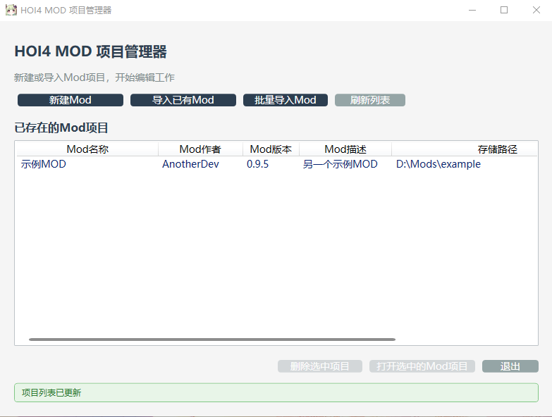
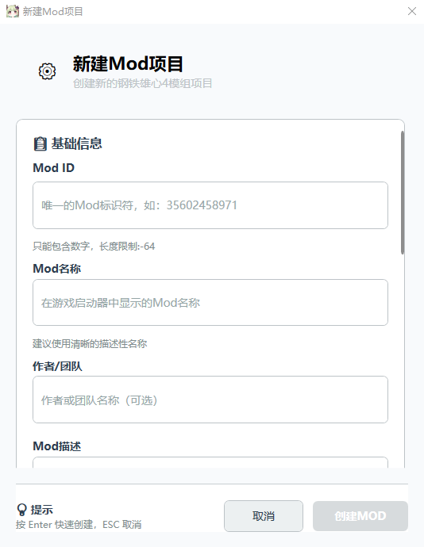
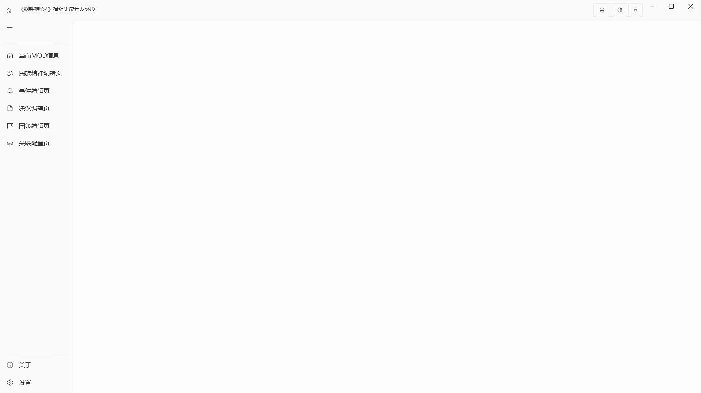
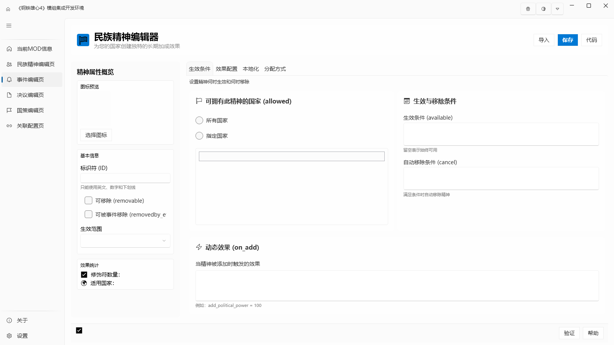
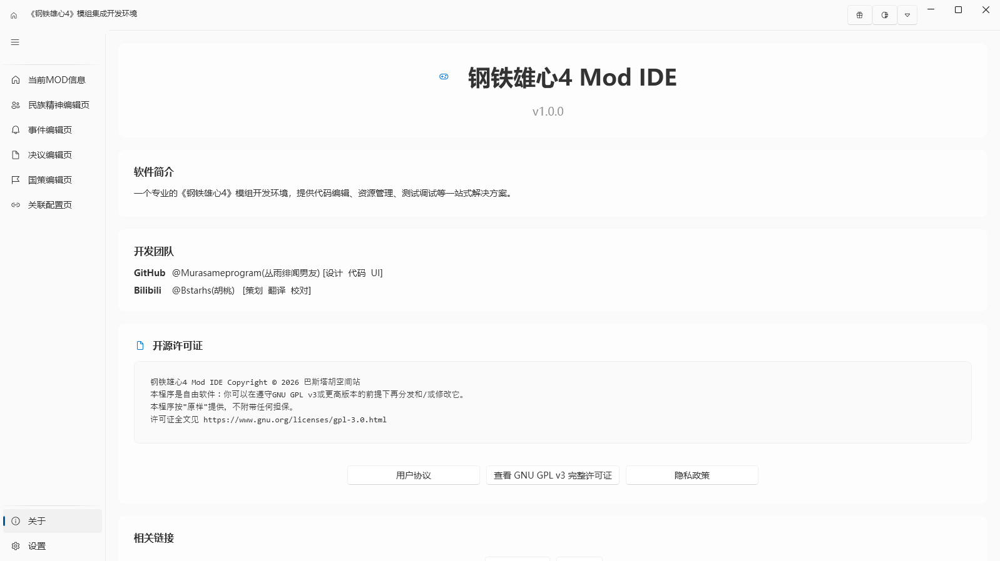
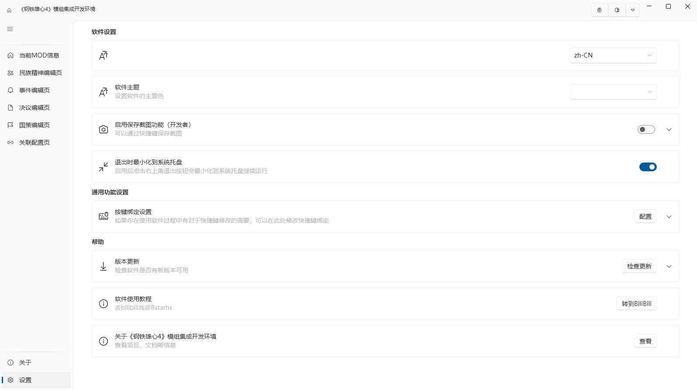

<div align="center">
  <h1 align="center">
    <a></a>
    <br/>
    <a>钢铁雄心4 Mod 集成开发环境</a>
  </h1>
</div>

[English](./Docs/English.md) | [中文](./README.md)| [繁体中文](./Docs/zh-TW.md)  


> **《钢铁雄心4》模组开发者的全能工具箱**  
> 告别手动创建文件夹和编辑文本文件，通过图形化界面轻松管理、创建和编辑 HOI4 模组。从项目初始化到游戏机制配置，一站式提升模组制作效率。

---

## 📋 项目状态

**当前版本：v0.0.5-测试版**  
测试版仅会发放至内部测试人员,暂不开放下载

- ✅ 项目管理器（新建/导入/删除/持久化）
- ✅ 新建 MOD 向导（自动生成标准目录结构）
- ✅ 主窗口框架（导航、主题切换、托盘图标）
- 🚧 多语言支持（内置 8 种语言）[已完成开发，测试中]
- 🚧 民族精神编辑器（UI 完成，逻辑开发中）
- 🚧 事件/国策/决议编辑器（规划中）

项目处于积极开发阶段，欢迎反馈和建议！

---

## ✨ 核心特性

### 📁 项目管理器
- 集中管理所有 MOD 项目，支持新建、导入、刷新、删除
- 导入现有 `.mod` 文件，自动解析元数据（名称、作者、版本等）
- 删除时可选“仅从列表移除”或“同时删除硬盘文件”
- 项目列表自动保存为 `projects.json`

### 🆕 新建 MOD 向导
- 可视化填写 MOD 信息（ID、名称、作者、版本、描述、游戏版本、标签）
- 自动生成符合 HOI4 规范的目录结构：
- 自动创建示例文件：国家标签、本地化、缩略图占位

### 🎨 可视化编辑器（开发中）
- **民族精神编辑器**：配置精神属性、生效条件、修饰符效果、本地化文本、获取方式（开局/国策/事件）
- 计划支持：事件编辑器、国策编辑器、决议编辑器、单位统计编辑器

### 🖥️ 现代化工作区
- 基于 `Wpf.Ui` 的流畅界面，支持亮色/暗色主题一键切换
- 动态标题栏显示当前打开的 MOD 名称和 ID
- 系统托盘图标，支持最小化到后台运行
- 内置导航菜单，快速切换不同编辑器

### 🌐 多语言支持
- 内置语言服务，支持以下语言：
- 简体中文、繁體中文、English、日本語、Deutsch、Français、Español、Русский
- 用户协议和隐私政策窗口支持实时切换语言

### ⚙️ 设置与关于
- 软件语言、主题、截图功能、快捷键绑定等设置项
- 关于页面显示版本信息、开发团队、开源许可证及快速链接

---

## 📸 界面预览

> ⚠️ 截图仅为示意，实际界面因软件版本问题可能略有不同

| 项目管理器 | 新建 MOD 向导|
|:---:|:---:|
|  |  |
| 主窗口 | 民族精神编辑器 |
|  |  |
| 关于页面 | 设置页面 |
|  |  |

---

## 🚀 快速开始

### 安装（使用预编译版本）

1. 前往 [Releases 页面](https://github.com/Murasameprogram/Hoi4-Mod-IDE/releases) 下载最新版本的 `Hoi4-Mod-IDE.zip`。
2. 解压到任意文件夹（例如 `C:\Program Files\Hoi4 Mod IDE`）。
3. 运行 `Hearts of Iron IV Mod IDE.exe`。
4. 首次启动将自动创建 `projects.json`，开始管理您的 MOD 项目。

> **系统要求**：Windows 10/11（64位），已安装 [.NET 9.0 运行时](https://dotnet.microsoft.com/zh-cn/download/dotnet/9.0)（若未安装，程序启动时会提示下载）。

### 从源码构建

#### 开发环境要求
- [Visual Studio](https://visualstudio.microsoft.com/)（建议使用Visual Studio2026，需包含“.NET 桌面开发”工作负载）
- [.NET 9.0 桌面运行时](https://dotnet.microsoft.com/zh-cn/download/dotnet/6.0)
- Git

#### 构建步骤
```bash
# 克隆仓库
git clone https://github.com/Murasameprogram/Hoi4-Mod-IDE.git
cd Hoi4-Mod-IDE

# 还原 NuGet 包
dotnet restore

# 构建项目
dotnet build -c Release

# 运行
dotnet run --project "Hearts of Iron IV Mod IDE.csproj"
```
或者直接用 Visual Studio 打开解决方案文件 `Hearts of Iron IV Mod IDE.sln`，按 F5 启动调试。

## 使用指南

- **创建新 MOD**：在项目管理器点击“新建 MOD”，填写表单，选择存储位置（推荐使用默认的 `文档/Paradox Interactive/Hearts of Iron IV/mod`），点击“创建”。

- **导入现有 MOD**：点击“导入 MOD”，选择您的 `.mod` 文件，程序将自动识别并添加到列表。

- **打开项目**：在项目列表中选中一个 MOD，点击“打开”，进入主工作区。

- **开始编辑**：使用左侧导航栏选择对应的编辑器（目前民族精神编辑器正在完善中）。

## 🛠️ 技术栈

- **框架**：.NET 6.0 / WPF
- **UI 库**：Wpf.Ui（提供现代化控件、导航、主题、消息提示、托盘图标）
- **MVVM 框架**：CommunityToolkit.Mvvm（ObservableObject、RelayCommand、源生成器）
- **依赖注入**：Microsoft.Extensions.DependencyInjection
- **日志记录**：Microsoft.Extensions.Logging
- **本地化**：WPFLocalizationExtension + 嵌入式资源文件（.resx + .ini）
- **JSON 处理**：System.Text.Json
- **文件操作**：System.IO

## 🤝 贡献指南

我们欢迎所有形式的贡献，包括但不限于：

- 报告 Bug（通过 Issues）
- 提出新功能建议
- 提交代码修复或新功能（Pull Request）
- 完善文档或翻译

### 贡献流程

1. Fork 本仓库
2. 创建您的特性分支：`git checkout -b feature/AmazingFeature`
3. 提交您的更改：`git commit -m 'Add some AmazingFeature'`
4. 推送到分支：`git push origin feature/AmazingFeature`
5. 打开一个 Pull Request

### 开发规范

- 保持现有的代码风格（使用 Rider 或 VS 默认格式化）
- 提交前确保项目能正常编译
- 若添加新功能，请同时更新相关文档
- 对于较大的改动，建议先开启 Issue 进行讨论

## 📄 许可证

本项目采用 GNU General Public License v3.0 开源。  
您可以在遵守 GPL v3 或更高版本的前提下自由使用、修改和分发本软件。

完整许可证文本请参阅 `LICENSE` 文件或访问 [GNU 通用公共许可证 V3.0](https://www.gnu.org/licenses/gpl-3.0.html)。

钢铁雄心4 Mod IDE Copyright © 2025 巴斯塔胡空间站<br>
本程序是自由软件：您可以在遵守GNU GPL v3或更高版本的前提下再分发和/或修改它。
本程序按"原样"提供，不附带任何担保。


## 👥 开发团队

- **Murasameprogram(丛雨绯闻男友)**  
  [GitHub](https://github.com/Murasameprogram) <br>
   核心开发、UI 设计、代码实现  

- **Bstarhs(胡桃)**  
  [GitHub](https://github.com/bstarhs) | [Bilibili](https://space.bilibili.com/545733083) <br>
  多语言支持，翻译、校对

## 🌟 致谢

- 感谢所有《钢铁雄心4》模组社区的玩家和开发者提供的宝贵反馈
- 感谢 Wpf.Ui 团队提供的现代化 UI 控件库，让项目界面更加美观
- 感谢 Paradox Interactive 为我们带来如此出色的游戏，激发创作灵感

## 📬 联系我们

- 如您需要更多的语言支持，请与我们联系
- 问题反馈：GitHub Issues
- 教程与公告：B站 [@Bstarhs](https://space.bilibili.com/545733083)
- 用户协议 & 隐私政策：在软件“关于”页面可查看多语言版本

如果您喜欢这个项目，请给一个 ⭐️ 支持我们！

2025年2月14日<br>
巴斯塔胡空间站

---
[软件更新日志](doc/Log.md)
