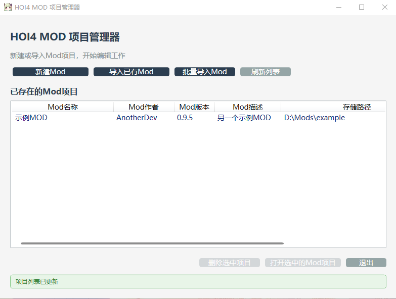
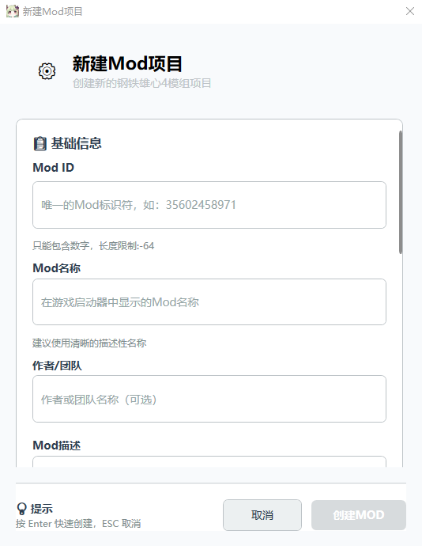
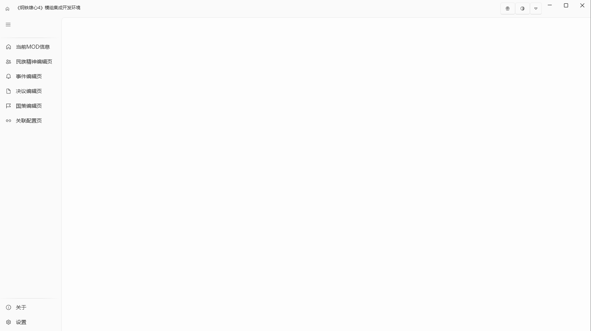
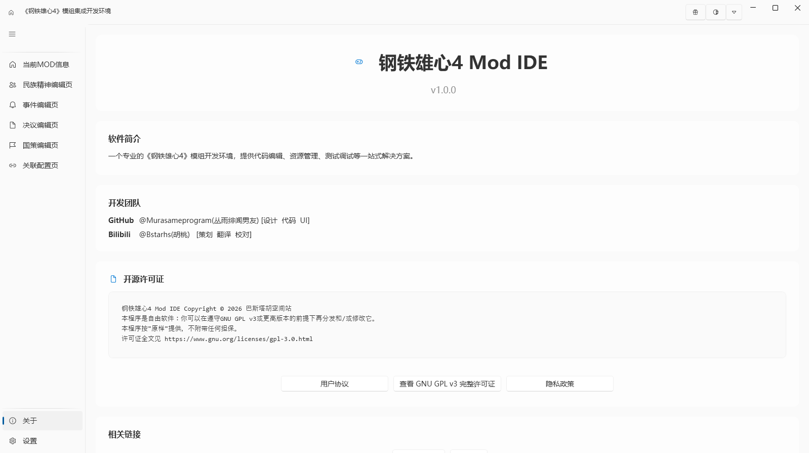
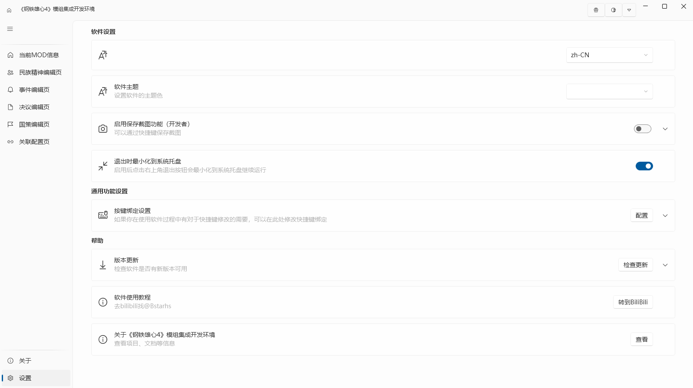

<div align="center">
  <h1 align="center">
    <a></a>
    <br/>
    <a>千月堂·MOD IDE</a>
  </h1>
</div>

[English](./Docs/English.md) | [中文](./README.md) | [繁体中文](./Docs/zh-TW.md")  


> **Paradox 游戏模组开发者的全能工具箱**
> 告别手动创建文件夹和编辑文本文件，通过图形化界面轻松管理、创建和编辑 Paradox 系列游戏的模组。从项目初始化到游戏机制配置，再到代码优化与插件扩展，一站式提升模组制作效率。支持 HOI4、EU4、CK3、VIC3、Stellaris 等 Paradox 游戏。

---

## 📋 项目状态

**已发行版本：v0.0.1-beta**<br>
**当前版本：v0.1.0-alpha(未发行)**  
本次更新带来了**框架大版本升级**，从 .NET 9.0 + WPF-UI 迁移至 **.NET 10 + WPF**，软件名称正式更改为**千月堂·MOD IDE**。

⚠️ **重要说明**：由于框架全面升级，之前版本实现的所有编辑器均已失效，需要重新制作。

- ✅ 项目管理器（新建/导入/删除/持久化）
- ✅ 新建 MOD 向导（自动生成标准目录结构）
- ✅ 主窗口框架（导航、主题切换、托盘图标）
- ✅ 多语言支持（内置 8 种语言）
- 🚧 **编辑器重构中**（因框架升级，所有编辑器需重新制作）
  - 🚧 民族精神编辑器（重构中）
  - 🚧 代码编辑器（规划中）
  - 🚧 MOD 优化工具（规划中）
  - 🚧 事件编辑器（规划中）
  - 🚧 国策/决议编辑器（规划中）
  - 🚧 单位统计编辑器（规划中）
- 🚧 插件系统（适配 .NET 10 中）

项目处于积极开发阶段，欢迎反馈和建议！

---

## ⚠️ 重要提示

由于软件进行了**框架大版本升级**（.NET 9.0 → .NET 10，WPF-UI → WPF），以下内容已失效：

- ❌ **所有旧版编辑器**：民族精神编辑器、代码编辑器等均需重新制作
- ❌ **旧版插件**：为旧框架开发的插件已完全不兼容
- ❌ **旧版教程**：所有教程和文档需要重新编写
- 🔄 **插件开发接口**：插件 API 已重新设计，请参考最新的[插件开发指南](./doc/Plugin%20Development%20Guide/插件开发指南.md)

**迁移建议**：
- 如需使用稳定版本，请继续使用 v0.0.1-beta（仅支持 HOI4）
- 新版 v0.1.0-alpha 正在重构中，编辑器功能将逐步恢复

---

## ✨ 核心特性

### 📁 项目管理器
- 集中管理所有 MOD 项目，支持新建、导入、刷新、删除
- 导入现有 `.mod` 文件，自动解析元数据（名称、作者、版本等）
- 删除时可选"仅从列表移除"或"同时删除硬盘文件"
- 项目列表自动保存为 `projects.json`
- **多游戏支持**：自动识别不同 Paradox 游戏的 MOD 文件格式

### 🆕 新建 MOD 向导
- 可视化填写 MOD 信息（ID、名称、作者、版本、描述、游戏版本、标签）
- **支持选择目标游戏**：HOI4、EU4、CK3、VIC3、Stellaris 等
- 自动生成符合对应游戏规范的目录结构
- 自动创建示例文件：国家标签、本地化、缩略图占位

### 🎨 可视化编辑器（重构中）

> ⚠️ **注意**：由于框架升级至 .NET 10，所有编辑器正在重新制作中。

- **游戏机制编辑器**：针对不同游戏提供专用的可视化编辑功能
  - HOI4：民族精神编辑器（重构中）
  - EU4/CK3/VIC3/Stellaris：对应游戏的专用编辑器（规划中）
- **代码编辑器**：内嵌代码高亮与实时语法检查（规划中）
- **MOD 优化工具**：智能扫描模组文件（规划中）
- *计划支持：事件编辑器、国策编辑器、决议编辑器、单位统计编辑器*

### 🧩 插件系统（适配中）

> ⚠️ **注意**：插件系统正在适配 .NET 10 框架，API 可能有较大变化。

- 提供完善的[插件开发文档](./doc/Plugin%20Development%20Guide/插件开发指南.md)，开发者可自由扩展 IDE 功能
- 插件与主程序之间通过**基于 JSON 的消息机制**进行通信
- 插件可**请求主程序服务**（获取当前项目信息、记录日志、导航到页面等）
- 插件之间也能**相互调用**：通过服务注册与发现机制
- 插件携带两个通信库：
  - `HostComms.dll`：处理与主程序的底层通信
  - `PluginComms.dll`：封装插件间协作的高级 API
- **多游戏支持**：插件可声明支持的游戏类型
- 未来将支持**社区插件商店**，一键安装他人共享的插件

### 🖥️ 现代化工作区
- 基于 **WPF** 的流畅界面，支持亮色/暗色主题一键切换
- 动态标题栏显示当前打开的 MOD 名称和 ID
- 系统托盘图标，支持最小化到后台运行
- 内置导航菜单，快速切换不同编辑器
- **游戏切换器**：快速在不同游戏的 MOD 项目间切换

### 🌐 多语言支持
- 内置语言服务，支持以下语言：
- 简体中文、繁體中文、English、日本語、Deutsch、Français、Español、Русский
- 用户协议和隐私政策窗口支持实时切换语言

### ⚙️ 设置与关于
- 软件语言、主题、截图功能、快捷键绑定等设置项
- 关于页面显示版本信息、开发团队、开源许可证及快速链接

---

## 📸 界面预览

> ⚠️ **重要提醒**：由于软件进行了框架大版本升级（.NET 10 + WPF），界面可能已发生变化。以下截图可能为旧版界面，仅供参考。

> ⚠️ 截图仅为示意，实际界面可能因软件版本不同而略有差异

| 项目管理器 | 新建 MOD 向导 |
|:---:|:---:|
|  |  |
| 主窗口 | 编辑器（重构中） |
|  |  |
| 关于页面 | 设置页面 |
|  |  |

> 💡 **获取最新界面**：请从 [Releases 页面](https://github.com/Murasameprogram/Hoi4-Mod-IDE/releases) 下载最新版本查看实际界面。

---

## 🚀 快速开始

### 安装（使用预编译版本）

1. 前往 [Releases 页面](https://github.com/Murasameprogram/Hoi4-Mod-IDE/releases) 下载最新版本的 `千月堂·MOD-IDE.zip`。
2. 解压到任意文件夹（例如 `C:\Program Files\千月堂·MOD IDE`）。
3. 运行 `千月堂·MOD IDE.exe`。
4. 首次启动将自动创建 `projects.json`，开始管理您的 MOD 项目。

> **系统要求**：Windows 10/11（64位），已安装 [.NET 10.0 运行时](https://dotnet.microsoft.com/zh-cn/download/dotnet/10.0)（若未安装，程序启动时会提示下载）。

> **支持的游戏**：HOI4、EU4、CK3、VIC3、Stellaris 等 Paradox Interactive 游戏。

> ⚠️ **注意**：当前版本为 alpha 测试版，编辑器功能正在重构中，建议使用稳定版 v0.0.1-beta 进行生产环境 MOD 开发。

### 从源码构建

#### 开发环境要求
- [Visual Studio 2026](https://visualstudio.microsoft.com/)（需包含".NET 桌面开发"工作负载）
- [.NET 10.0 SDK](https://dotnet.microsoft.com/zh-cn/download/dotnet/10.0)
- Git

#### 构建步骤
```bash
# 克隆仓库
git clone https://github.com/Murasameprogram/Hoi4-Mod-IDE.git
cd Hoi4-Mod-IDE

# 还原 NuGet 包
dotnet restore

# 构建项目
dotnet build -c Release

# 运行
dotnet run --project "千月堂·MOD IDE.csproj"
```
或者直接用 Visual Studio 打开解决方案文件 `千月堂·MOD IDE.sln`，按 F5 启动调试。

## 使用指南

> ⚠️ **注意**：当前版本 v0.1.0-alpha 为框架大改后的重构版本，编辑器功能正在逐步恢复中。

- **选择目标游戏**：启动 IDE 后，首先在设置中选择您要开发的 MOD 对应的 Paradox 游戏（HOI4、EU4、CK3、VIC3、Stellaris 等）。

- **创建新 MOD**：在项目管理器点击"新建 MOD"，选择目标游戏，填写表单，选择存储位置（推荐使用默认路径，如 `文档/Paradox Interactive/[游戏名称]/mod`），点击"创建"。

- **导入现有 MOD**：点击"导入 MOD"，选择您的 `.mod` 文件，程序将自动识别游戏类型并添加到列表。

- **打开项目**：在项目列表中选中一个 MOD，点击"打开"，进入主工作区。

- **开始编辑**：
  > ⚠️ 由于框架升级，编辑器正在重新制作中，当前版本可能功能不完整。

  使用左侧导航栏选择对应的编辑器（编辑器重构完成后将恢复完整功能）。

- **安装插件**：
  > ⚠️ 插件系统正在适配 .NET 10 框架，旧版插件不兼容。

  将插件 `.dll` 放入 `Plugins` 文件夹，重启 IDE 即可自动加载（插件开发请参考[插件开发指南](./doc/Plugin%20Development%20Guide/插件开发指南.md)）。

### 🎮 各游戏专用功能（规划中）

| 游戏 | 支持的功能（规划中） |
|:---|:---|
| **HOI4** | 民族精神编辑器（重构中）、事件编辑器（规划中）、国策编辑器（规划中） |
| **EU4** | 事件编辑器（规划中）、决议编辑器（规划中） |
| **CK3** | 事件编辑器（规划中）、决议编辑器（规划中） |
| **VIC3** | 事件编辑器（规划中）、经济编辑器（规划中） |
| **Stellaris** | 事件编辑器（规划中）、物种编辑器（规划中） |

> **注意**：功能恢复进度请参考[项目状态](#-项目状态)。当前建议使用稳定版 v0.0.1-beta 进行 MOD 开发。

## 🛠️ 技术栈

- **框架**：.NET 10 / WPF
- **UI 库**：WPF 原生控件（迁移自 Wpf.Ui）
- **MVVM 框架**：CommunityToolkit.Mvvm（ObservableObject、RelayCommand、源生成器）
- **依赖注入**：Microsoft.Extensions.DependencyInjection
- **日志记录**：Microsoft.Extensions.Logging
- **本地化**：WPFLocalizationExtension + 嵌入式资源文件（.resx + .ini）
- **JSON 处理**：System.Text.Json
- **文件操作**：System.IO
- **游戏支持**：通过插件化架构支持多款 Paradox 游戏（HOI4、EU4、CK3、VIC3、Stellaris 等）

## 🤝 贡献指南

我们欢迎所有形式的贡献，包括但不限于：

- 报告 Bug（通过 Issues）
- 提出新功能建议
- 提交代码修复或新功能（Pull Request）
- 完善文档或翻译
- 开发插件并分享

### 贡献流程

1. Fork 本仓库
2. 创建您的特性分支：`git checkout -b feature/AmazingFeature`
3. 提交您的更改：`git commit -m 'Add some AmazingFeature'`
4. 推送到分支：`git push origin feature/AmazingFeature`
5. 打开一个 Pull Request

### 开发规范

- 保持现有的代码风格（使用 Rider 或 VS 默认格式化）
- 提交前确保项目能正常编译
- 若添加新功能，请同时更新相关文档
- 对于较大的改动，建议先开启 Issue 进行讨论

## 📄 许可证

本项目采用 GNU General Public License v3.0 开源。  
您可以在遵守 GPL v3 或更高版本的前提下自由使用、修改和分发本软件。

完整许可证文本请参阅 `LICENSE` 文件或访问 [GNU 通用公共许可证 V3.0](https://www.gnu.org/licenses/gpl-3.0.html)。

千月堂·MOD IDE Copyright © 2025-2026 千月堂<br>
本程序是自由软件：您可以在遵守GNU GPL v3或更高版本的前提下再分发和/或修改它。
本程序按"原样"提供，不附带任何担保。

## 👥 开发团队(千月堂)

- **Murasameprogram（丛雨绯闻男友）**  
  [GitHub](https://github.com/Murasameprogram) <br>
  核心开发、UI 设计、代码实现  

- **Bstarhs（胡桃）**  
  [GitHub](https://github.com/bstarhs) | [Bilibili](https://space.bilibili.com/545733083) <br>
  多语言支持，翻译、校对

## 🌟 致谢

- 感谢所有 Paradox 游戏模组社区的玩家和开发者提供的宝贵反馈
- 感谢 Wpf.Ui 团队提供的现代化 UI 控件库，让项目界面更加美观
- 感谢 Paradox Interactive 为我们带来如此出色的游戏，激发创作灵感
- 感谢所有为项目提供翻译、测试和代码贡献的贡献者

## 📬 联系我们

- 如您需要更多的语言支持，请与我们联系
- 问题反馈：GitHub Issues
- 教程与公告：B站 [@Bstarhs](https://space.bilibili.com/545733083)
- QQ群：950718988（**仅可通过群号搜索**）
- 用户协议 & 隐私政策：在软件"关于"页面可查看多语言版本

**版本说明**：
- 稳定版：v0.0.1-beta（仅支持 HOI4，功能完整）
- 开发版：v0.1.0-alpha（支持多游戏，编辑器重构中）

如果您喜欢这个项目，请给一个 ⭐️ 支持我们！

**2026年5月26日**<br>
**巴斯塔胡空间站·千月堂项目组**
---
[软件更新日志](./doc/Log.md) · [插件开发指南](./doc/Plugin%20Development%20Guide/插件开发指南.md) · [多游戏支持说明](./doc/Multi-Game-Support.md) · [框架升级说明](./doc/Framework-Upgrade.md)
