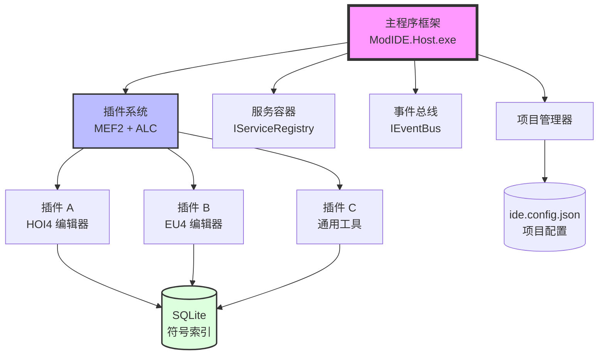

<div align="center">
  <h1 align="center">
    <a></a>
    <br/>
    <a>千月堂·MOD IDE</a>
  </h1>
</div>

> **Paradox 游戏模组开发者的全能工具箱**
> 
> **核心设计哲学**：主程序只是一个框架，自身不具备任何 MOD 编辑能力。所有 MOD 功能均由插件提供。
> 
> 告别手动创建文件夹和编辑文本文件，通过图形化界面轻松管理、创建和编辑 Paradox 系列游戏的模组。从项目初始化到游戏机制配置，再通过插件扩展无限可能，一站式提升模组制作效率。支持 HOI4、EU4、CK3、VIC3、Stellaris 等 Paradox 游戏。

---

## 📋 项目状态

**已发行版本：v0.0.1-beta**<br>
**当前版本：v0.1.0-alpha(未发行)**  

本次更新带来了**架构全面重构**，采用**插件化架构**（主程序 = 纯框架，所有功能 = 插件），从 .NET 9.0 + WPF-UI 迁移至 **.NET 10 + WPF**，软件名称正式更改为**千月堂·MOD IDE**。

### 架构升级要点

- ✅ **单项目逻辑分层**：Core / Infrastructure / Presentation 三层架构
- ✅ **MEF2 + ALC 隔离**：插件通过 MEF2 加载，ALC 实现插件隔离
- ✅ **两阶段插件加载**：阶段一（读取 manifest.json）→ 阶段二（MEF2 加载 DLL）
- ✅ **动态 UI 框架**：三栏布局（图标栏 + Side Bar + 主工作区）
- ✅ **SQLite 索引**：近期项目数据库 + 符号索引数据库

⚠️ **重要说明**：由于架构全面重构，之前版本实现的所有编辑器均已失效，需要作为插件重新制作。

### 功能状态

- ✅ 主程序框架（窗口管理、插件加载、服务注册）
- ✅ 项目管理器（新建/导入/删除/持久化）
- ✅ 新建 MOD 向导（自动生成标准目录结构）
- ✅ 主窗口框架（导航、主题切换、托盘图标）
- ✅ 多语言支持（内置 8 种语言）
- 🚧 **插件系统重构中**（MEF2 + ALC 两阶段加载）
- 🚧 **编辑器插件重构中**（因架构升级，所有编辑器需重新制作）

项目处于积极开发阶段，欢迎反馈和建议！

---

## 🏗️ 架构概述

> 核心设计原则：**主程序只是一个框架，自身不具备任何 MOD 编辑能力，也不具备解析能力。所有 MOD 功能均由插件提供。**

### 架构图


```mermaid
graph TB
    A[主程序框架<br/>ModIDE.Host.exe] --> B[插件系统<br/>MEF2 + ALC]
    A --> C[服务容器<br/>IServiceRegistry]
    A --> D[事件总线<br/>IEventBus]
    
    B --> E[插件 A<br/>HOI4 编辑器]
    B --> F[插件 B<br/>EU4 编辑器]
    B --> G[插件 C<br/>通用工具]
    
    E --> H[(SQLite<br/>符号索引)]
    F --> H
    G --> H
    
    A --> I[项目管理器]
    I --> J[(ide.config.json<br/>项目配置)]
    
    style A fill:#f9f,stroke:#333,stroke-width:4px
    style B fill:#bbf,stroke:#333,stroke-width:2px
    style H fill:#dfd,stroke:#333,stroke-width:2px
```

---

## ⚠️ 重要提示

由于软件进行了**框架大版本升级**（.NET 9.0 → .NET 10，WPF-UI → WPF），以下内容已失效：

- ❌ **所有旧版编辑器**：民族精神编辑器、代码编辑器等均需重新制作
- ❌ **旧版插件**：为旧框架开发的插件已完全不兼容
- ❌ **旧版教程**：所有教程和文档需要重新编写
- 🔄 **插件开发接口**：插件 API 已重新设计，请参考最新的[插件开发指南](./doc/Plugin%20Development%20Guide/插件开发指南.md)

**迁移建议**：
- 如需使用稳定版本，请继续使用 v0.0.1-beta（仅支持 HOI4）
- 新版 v0.1.0-alpha 正在重构中，编辑器功能将逐步恢复

---

## ✨ 核心特性

### 📁 项目管理器
- 集中管理所有 MOD 项目，支持新建、导入、刷新、删除
- 导入现有 `.mod` 文件，自动解析元数据（名称、作者、版本等）
- 删除时可选"仅从列表移除"或"同时删除硬盘文件"
- 项目配置保存为 `ide.config.json`（位于 Mod 项目根目录）
- **多游戏支持**：自动识别不同 Paradox 游戏的 MOD 文件格式

### 🆕 新建 MOD 向导
- 可视化填写 MOD 信息（ID、名称、作者、版本、描述、游戏版本、标签）
- **支持选择目标游戏**：HOI4、EU4、CK3、VIC3、Stellaris 等
- 自动生成符合对应游戏规范的目录结构
- 自动创建示例文件：国家标签、本地化、缩略图占位

### 🧩 插件系统（两阶段加载）

> ⚠️ **架构核心**：主程序只是一个框架，自身不具备任何 MOD 编辑能力。所有 MOD 功能均由插件提供。

#### 两阶段加载机制

**阶段一：声明过滤（不加载 DLL）**
- 扫描 `Plugins/` 目录
- 读取每个插件的 `manifest.json`（插件清单）
- 根据 `supportedGames` 过滤出适用于当前游戏的插件
- 根据 `minHostVersion` 检查兼容性

**阶段二：MEF2 + ALC 加载（加载 DLL）**
- 通过 `System.Composition`（MEF2）发现和加载插件
- 使用 `AssemblyLoadContext`（ALC）实现插件隔离
- 调用插件的 `Initialize()` 方法完成初始化
- 通过 `[Export]` / `[Import]` 特性实现服务注册与发现

#### 插件清单（manifest.json）

```json
{
  "id": "com.qyt.hoi4-editor",
  "name": "HOI4 编辑器",
  "version": "1.0.0",
  "author": "千月堂",
  "description": "提供 HOI4 的民族精神、事件、国策等编辑器",
  "supportedGames": ["HOI4"],
  "minHostVersion": "0.1.0",
  "entry": "QYT.HOI4.Editor.dll",
  "dependencies": []
}
```

#### 插件通信

- **请求主程序服务**：通过 `IServiceRegistry` 获取主程序服务（获取当前项目信息、记录日志、导航到页面等）
- **插件间通信**：通过 `IEventBus` 发布/订阅事件，或通过服务注册与发现机制相互调用
- **通信库**：
  - `HostComms.dll`：处理与主程序的底层通信
  - `PluginComms.dll`：封装插件间协作的高级 API

#### 插件开发快捷方式

使用 `dotnet new qyt-plugin -G HOI4 -N "MyPlugin"` 快速创建插件项目骨架（自动生成 `manifest.json`、特性标注、ALC 隔离样板代码）

#### 动态 UI 规范

| 原则 | 具体要求 |
|------|----------|
| **视觉反馈** | 所有可交互元素必须有悬停（Hover）/ 按下（Pressed）/ 禁用（Disabled）/ 选中（Selected）四种状态的视觉差异 |
| **过渡动画** | 所有状态切换（显示/隐藏、展开/折叠、选中/取消、页面切换）必须有平滑的过渡动画（150-300ms） |
| **加载状态** | 所有异步操作必须有明确的加载动画（Skeleton / Spinner / Progress Bar） |
| **微交互** | 按钮点击有 Ripple 效果、卡片悬停有轻微上浮阴影、列表项选择有滑动高亮条 |
| **错误反馈** | 验证失败、保存失败、操作不可用时，必须有所见即所得的错误提示动画（Shake / Red Glow / Toast 滑入） |
| **一致性** | 所有插件的 UI 必须遵循同一套动画规范和视觉反馈标准 |

### 🌐 多语言支持
- 内置语言服务，支持以下语言：
- 简体中文、繁體中文、English、日本語、Deutsch、Français、Español、Русский
- 用户协议和隐私政策窗口支持实时切换语言

### ⚙️ 设置与关于
- 软件语言、主题、截图功能、快捷键绑定等设置项
- 关于页面显示版本信息、开发团队、开源许可证及快速链接

---

## 🚀 快速开始

### 安装（使用预编译版本）

1. 前往 [Releases 页面](https://github.com/Murasameprogram/Hoi4-Mod-IDE/releases) 下载最新版本的 `千月堂·MOD-IDE.zip`。
2. 解压到任意文件夹（例如 `C:\Program Files\千月堂·MOD IDE`）。
3. 运行 `千月堂·MOD IDE.exe`。
4. 首次启动将自动创建 `projects.json`，开始管理您的 MOD 项目。

> **系统要求**：Windows 10/11（64位），已安装 [.NET 10.0 运行时](https://dotnet.microsoft.com/zh-cn/download/dotnet/10.0)（若未安装，程序启动时会提示下载）。

> **支持的游戏**：HOI4、EU4、CK3、VIC3、Stellaris 等 Paradox Interactive 游戏。

> ⚠️ **注意**：当前版本为 alpha 测试版，编辑器功能正在重构中，建议使用稳定版 v0.0.1-beta 进行生产环境 MOD 开发。

### 从源码构建

#### 开发环境要求
- [Visual Studio 2026](https://visualstudio.microsoft.com/)（需包含".NET 桌面开发"工作负载）
- [.NET 10.0 SDK](https://dotnet.microsoft.com/zh-cn/download/dotnet/10.0)
- Git

#### 构建步骤
```bash
# 克隆仓库
git clone https://github.com/Murasameprogram/Hoi4-Mod-IDE.git
cd Hoi4-Mod-IDE

# 还原 NuGet 包
dotnet restore

# 构建项目
dotnet build -c Release

# 运行
dotnet run --project "千月堂·MOD IDE.csproj"
```
或者直接用 Visual Studio 打开解决方案文件 `千月堂·MOD IDE.sln`，按 F5 启动调试。

## 使用指南

> ⚠️ **架构说明**：千月堂·MOD IDE 采用**插件化架构**。主程序只是一个框架，自身不具备任何 MOD 编辑能力。所有 MOD 功能（编辑器、工具等）均由插件提供。

### 快速开始

1. **选择目标游戏**：启动 IDE 后，首先在设置中选择您要开发的 MOD 对应的 Paradox 游戏（HOI4、EU4、CK3、VIC3、Stellaris 等）。

2. **创建新 MOD**：在项目管理器点击"新建 MOD"，选择目标游戏，填写表单，选择存储位置（推荐使用默认路径，如 `文档/Paradox Interactive/[游戏名称]/mod`），点击"创建"。

3. **导入现有 MOD**：点击"导入 MOD"，选择您的 `.mod` 文件，程序将自动识别游戏类型并添加到列表。

4. **打开项目**：在项目列表中选中一个 MOD，点击"打开"，进入主工作区。

5. **开始编辑**：
   > ⚠️ 由于采用插件化架构，编辑器功能由插件提供。请确保已安装对应游戏的编辑器插件。

   使用左侧图标栏切换不同工具窗口，在主工作区进行编辑。

### 插件管理

> 📦 **插件是功能的载体**：所有 MOD 编辑能力（民族精神编辑器、事件编辑器、代码编辑器等）都通过插件提供。

#### 安装插件

1. 将插件 `.dll` 和 `manifest.json` 放入 `Plugins/` 文件夹
2. 重启 IDE，主程序将自动加载插件（两阶段加载：先读取 manifest.json 过滤，再通过 MEF2 加载 DLL）
3. 插件加载后，对应功能将出现在左侧图标栏

#### 插件开发

参考[插件开发指南](./doc/Plugin%20Development%20Guide/插件开发指南.md)，快速创建插件项目：

```bash
# 安装插件模板
dotnet new install QYT.Templates

# 创建 HOI4 编辑器插件
dotnet new qyt-plugin -G HOI4 -N "MyPlugin"
```

#### 插件清单（manifest.json）

每个插件必须包含 `manifest.json`，声明插件 ID、名称、支持的游戏、依赖等：

```json
{
  "id": "com.qyt.hoi4-editor",
  "name": "HOI4 编辑器",
  "version": "1.0.0",
  "author": "千月堂",
  "description": "提供 HOI4 的民族精神、事件、国策等编辑器",
  "supportedGames": ["HOI4"],
  "minHostVersion": "0.1.0",
  "entry": "QYT.HOI4.Editor.dll",
  "dependencies": []
}
```

### 🎮 各游戏专用功能（由插件提供）

| 游戏 | 支持的功能（由插件提供） |
|:---|:---|
| **HOI4** | 民族精神编辑器（插件）、事件编辑器（插件）、国策编辑器（插件） |
| **EU4** | 事件编辑器（插件）、决议编辑器（插件） |
| **CK3** | 事件编辑器（插件）、决议编辑器（插件） |
| **VIC3** | 事件编辑器（插件）、经济编辑器（插件） |
| **Stellaris** | 事件编辑器（插件）、物种编辑器（插件） |

> **注意**：功能恢复进度请参考[项目状态](#-项目状态)。当前建议使用稳定版 v0.0.1-beta 进行 MOD 开发。
---

## 🛠️ 技术栈

### 核心框架
- **框架**：.NET 10 / WPF-UI 
- **MVVM 框架**：CommunityToolkit.Mvvm（ObservableObject、RelayCommand、源生成器）
- **依赖注入**：Microsoft.Extensions.DependencyInjection
- **JSON 处理**：System.Text.Json
- **文件操作**：System.IO

### 插件系统
- **插件框架**：MEF2（System.Composition）
- **隔离机制**：AssemblyLoadContext（ALC）
- **通信机制**：JSON 消息机制 + IEventBus 事件总线
- **服务注册**：IServiceRegistry 服务注册与发现

### 数据持久化
- **数据库**：SQLite（Microsoft.Data.Sqlite）
- **项目配置**：ide.config.json（位于 Mod 项目根目录）
- **插件清单**：manifest.json（位于每个插件目录根目录）
- **近期项目数据库**：RecentProjects.db（SQLite）
- **符号索引数据库**：SymbolIndex.db（SQLite）

### UI 与交互
- **本地化**：WPFLocalizationExtension + 嵌入式资源文件（.resx + .ini）
- **日志记录**：Microsoft.Extensions.Logging
- **动画资源**：所有过渡动画、微交互、加载状态动画
- **动态 UI**：所有可交互元素必须有悬停/按下/禁用/选中四种状态的视觉差异

### 游戏支持
- **支持的游戏**：HOI4、EU4、CK3、VIC3、Stellaris 等 Paradox Interactive 游戏
- **游戏检测**：IGameDetectionService（自动识别不同 Paradox 游戏的 MOD 文件格式）
- **多游戏支持**：插件可声明支持的游戏类型（`supportedGames`），主程序自动过滤

---

我们欢迎所有形式的贡献，包括但不限于：

- 报告 Bug（通过 Issues）
- 提出新功能建议
- 提交代码修复或新功能（Pull Request）
- 完善文档或翻译
- 开发插件并分享

### 贡献流程

1. Fork 本仓库
2. 创建您的特性分支：`git checkout -b feature/AmazingFeature`
3. 提交您的更改：`git commit -m 'Add some AmazingFeature'`
4. 推送到分支：`git push origin feature/AmazingFeature`
5. 打开一个 Pull Request

### 开发规范

- 保持现有的代码风格（使用 Rider 或 VS 默认格式化）
- 提交前确保项目能正常编译
- 若添加新功能，请同时更新相关文档
- 对于较大的改动，建议先开启 Issue 进行讨论

## 📄 许可证

本项目采用 GNU General Public License v3.0 开源。  
您可以在遵守 GPL v3 或更高版本的前提下自由使用、修改和分发本软件。

完整许可证文本请参阅 `LICENSE` 文件或访问 [GNU 通用公共许可证 V3.0](https://www.gnu.org/licenses/gpl-3.0.html)。

千月堂·MOD IDE Copyright © 2025-2026 千月堂<br>
本程序是自由软件：您可以在遵守GNU GPL v3或更高版本的前提下再分发和/或修改它。
本程序按"原样"提供，不附带任何担保。

## 👥 开发团队(千月堂)

- **Murasameprogram（丛雨绯闻男友）**  
  [GitHub](https://github.com/Murasameprogram) <br>
  核心开发、UI 设计、代码实现  

- **Bstarhs（胡桃）**  
  [GitHub](https://github.com/bstarhs) | [Bilibili](https://space.bilibili.com/545733083) <br>
  多语言支持，翻译、校对

## 🌟 致谢

- 感谢所有 Paradox 游戏模组社区的玩家和开发者提供的宝贵反馈
- 感谢 Microsoft 提供的 .NET 10 和 WPF 框架，让项目能够顺利升级
- 感谢 Paradox Interactive 为我们带来如此出色的游戏，激发创作灵感
- 感谢所有为项目提供翻译、测试和代码贡献的贡献者
- 感谢 MEF2 和 ALC 团队提供的强大插件隔离机制

## 📬 联系我们

- 如您需要更多的语言支持，请与我们联系
- 问题反馈：GitHub Issues
- 教程与公告：B站 [@Bstarhs](https://space.bilibili.com/545733083)
- QQ群：950718988（**仅可通过群号搜索**）
- 用户协议 & 隐私政策：在软件"关于"页面可查看多语言版本

**版本说明**：
- 稳定版：v0.0.1-beta（仅支持 HOI4，功能完整）
- 开发版：v0.1.0-alpha（支持多游戏，编辑器重构中）

如果您喜欢这个项目，请给一个 ⭐️ 支持我们！

2026年5月26日<br>
巴斯塔胡空间站·千月堂项目组
---
[软件更新日志](./doc/Log.md) · [插件开发指南](./doc/Plugin%20Development%20Guide/插件开发指南.md) · [架构设计文档](./docs/architecture.md) · [多游戏支持说明](./doc/Multi-Game-Support.md)
